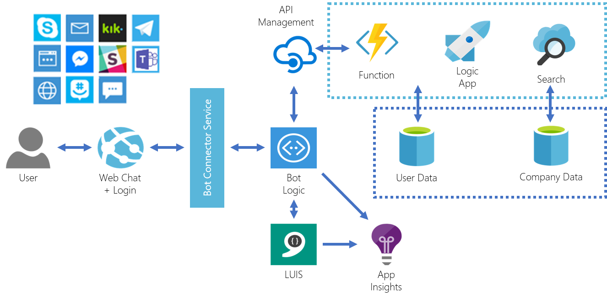

# Advanced bot on azure with NodeJs
This sample shows you how to deploy an advanced bot hosted on Azure Websites. 

For a complete end-to-end walk-through of creating this application, please refer to the [Bot Builder SDK for Node.js](https://docs.microsoft.com/en-us/bot-framework/nodejs/bot-builder-nodejs-overview)
This sample is based on https://github.com/Microsoft/BotBuilder-Samples/tree/master/Node/intelligence-LUIS

## Deploying this sample
1. Deploy the arm template in arm/template.json to azure

  

It will deploy the following resources
- Azure Web App
- Logic App
- Application Insights
- Azure Search
- Cosmos DB
- LUIS
- Azure Function
- Code from github to the WebApp
- Configuration from all resource to environment variables in the web app and function

## Prepare your blank azure vm for development

1. Open Internet Explorer (does not work on Chrome) and paste the following URL: 

http://boxstarter.org/package/nr/url?https://raw.githubusercontent.com/denniszielke/hackbotsimple/master/scboxstarter.txt

2. Click Run on the security warning. 
3. Click Run again when prompted. 
4. This will take about 5 minutes and does the setup of prerequired software: Visual Studio Code, NodeJs, Git, Google Chrome, Fiddler4
5. Download the bot framework emulator from https://emulator.botframework.com/ 

## Register your bot with Microsoft
Go to https://dev.botframework.com/bots and create a new bot.
Give it a name and enter the application insights values from the initial resource deployment